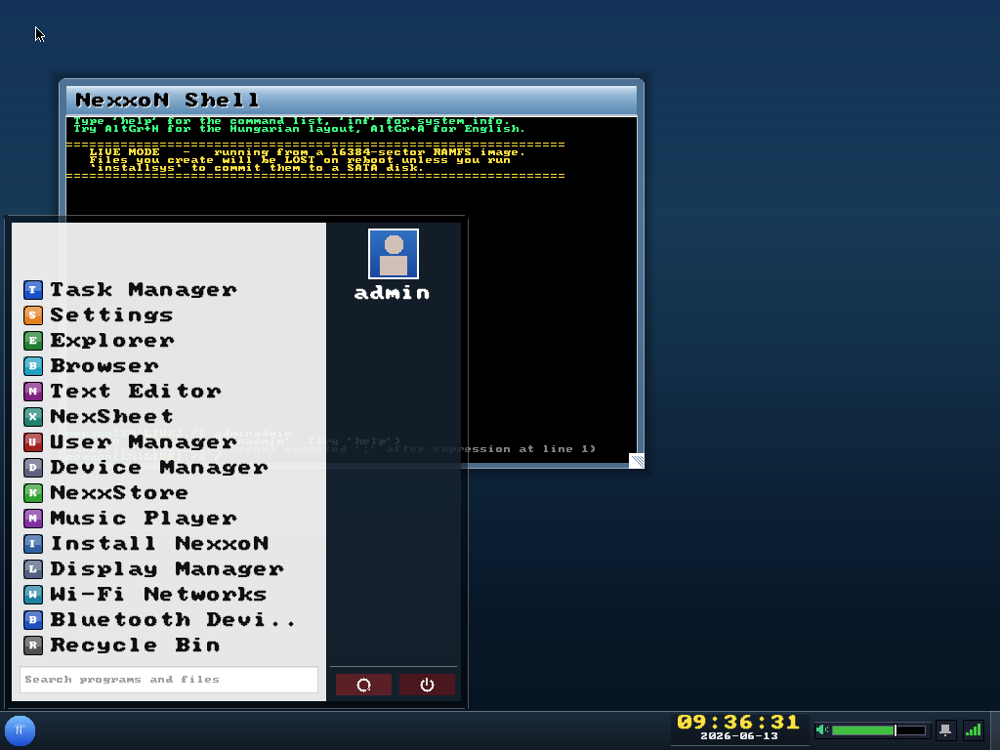
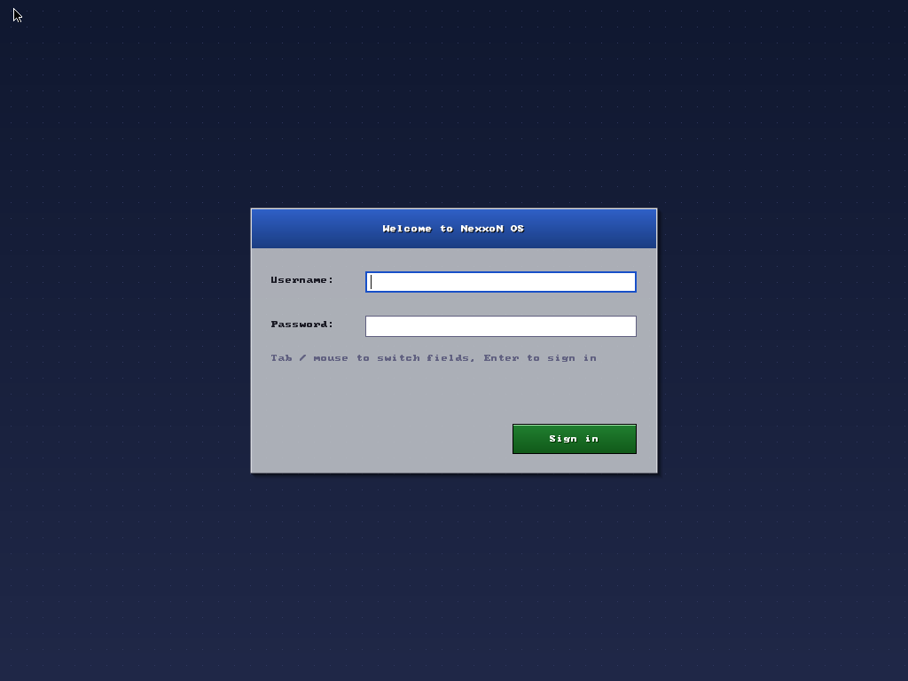
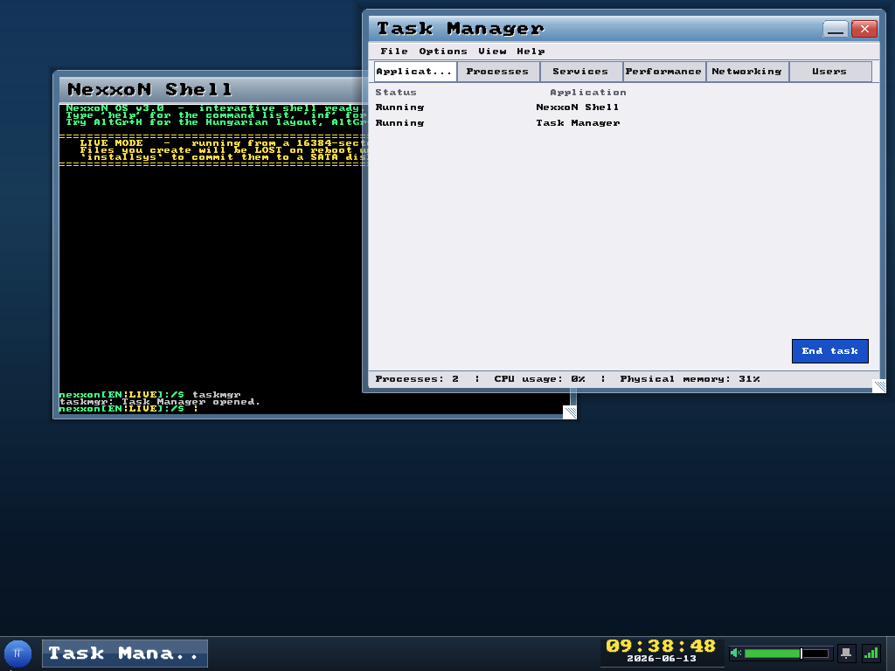
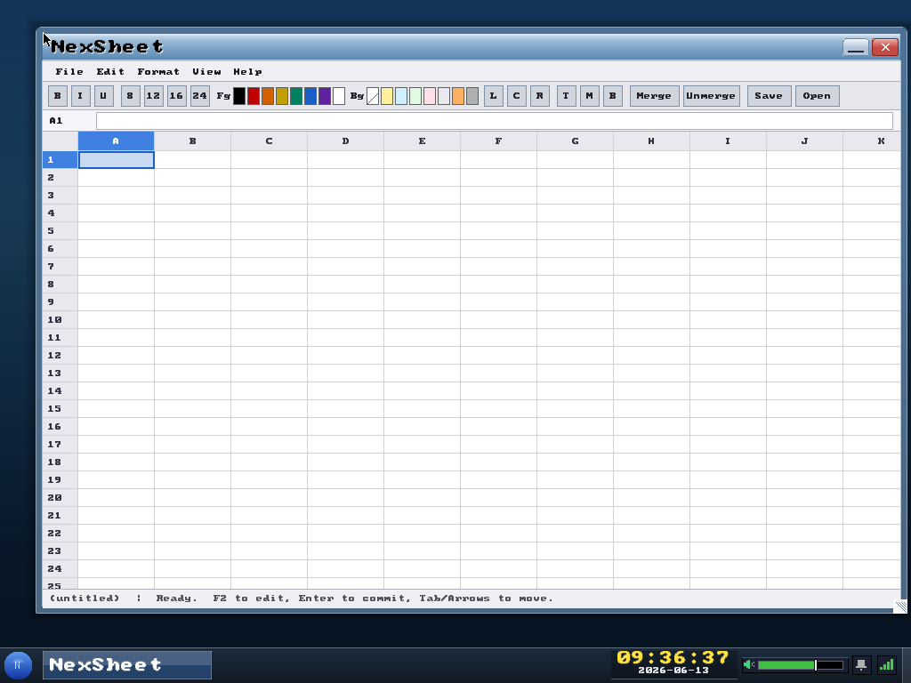
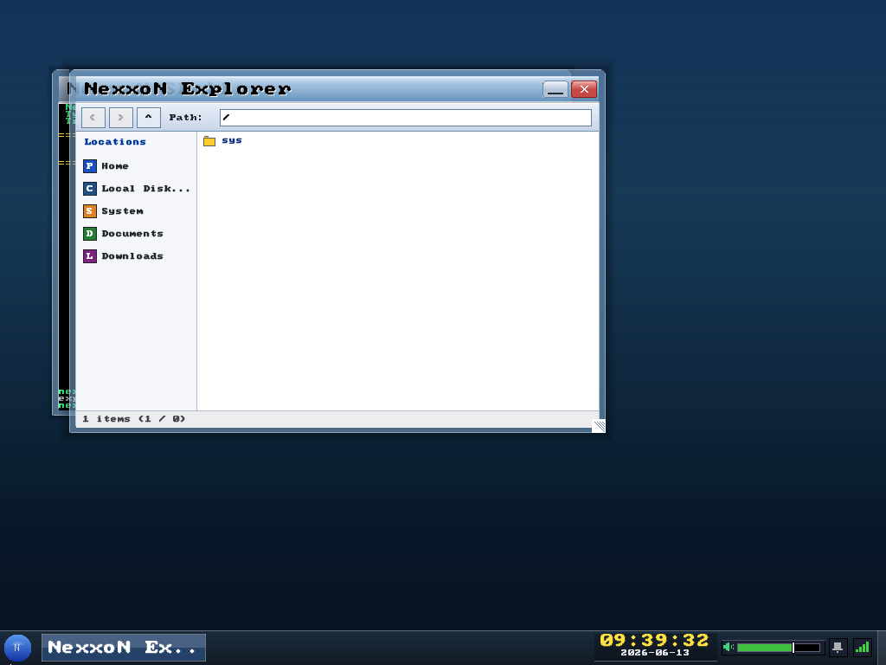
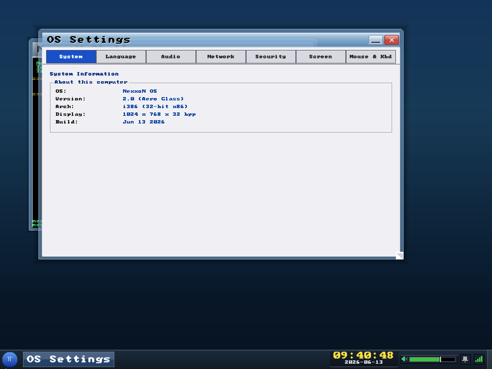
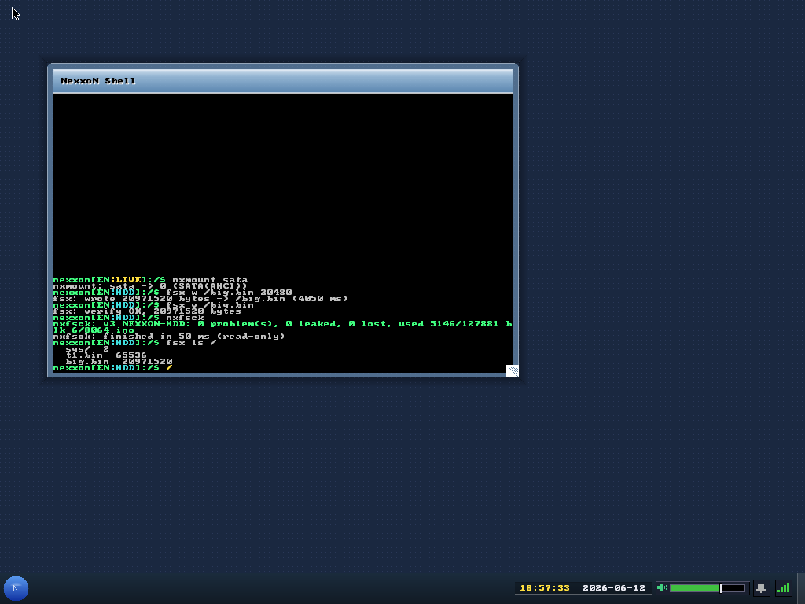

<p align="center">
  
</p>

<h1 align="center">🖥️ NexxoN OS</h1>

<p align="center">
  <em>A complete, graphical, networked desktop operating system - written entirely from scratch.</em><br>
  <strong>No Linux. No libc. No borrowed binaries.</strong> Every byte, from the boot sector to the web browser, is hand-written.
</p>

<p align="center">
  
  
  
  
  
  
  
</p>

---

## What is this?

Most hobby operating systems stop at *"hello world on a VGA text screen."*
**NexxoN OS is a real desktop OS** - it boots on bare metal, brings up a 1024×768
true-colour framebuffer, and drops you into a compositing window manager with a
taskbar, start menu, login screen, and a full suite of GUI apps. It talks to the
network, plays audio through real hardware codecs, mounts USB sticks, and stores
your files in a **journaling filesystem that survives power cuts**.

> **110+ source files · 50 000+ lines of C and x86 assembly · one ~8 MB bootable image.**

<table>
  <tr>
    <td width="50%"></td>
    <td width="50%"></td>
  </tr>
  <tr>
    <td align="center"><sub>🔐 Graphical login (salted SHA-256 auth)</sub></td>
    <td align="center"><sub>🪟 Compositing WM with Aero chrome - multiple windows</sub></td>
  </tr>
  <tr>
    <td width="50%"></td>
    <td width="50%"></td>
  </tr>
  <tr>
    <td align="center"><sub>📊 NexSheet - Excel-style spreadsheet (formulas, XLSX)</sub></td>
    <td align="center"><sub>📁 Explorer - browse NXFS &amp; USB drives</sub></td>
  </tr>
  <tr>
    <td width="50%"></td>
    <td width="50%"></td>
  </tr>
  <tr>
    <td align="center"><sub>⚙️ Settings - system, language, audio, network, security</sub></td>
    <td align="center"><sub>🗄️ NXFS v3 - a 20 MiB file written &amp; verified, fsck-clean</sub></td>
  </tr>
</table>

---

## What the system CAN do

### Boot & core kernel
- ✅ Boots from **GRUB (CD/USB live)** *and* from an **installed SATA disk via its own
  hand-written 2-stage bootloader** (`installsys` writes the MBR + stage1/stage2 + kernel).
- ✅ **64-bit x86_64 long mode** (4-level paging, 64-bit GDT/IDT/TSS, ring-3
  syscalls, runtime VBE resolution switching). PIC/PIT/RTC, ACPI shutdown.
- ✅ **Preemptive round-robin scheduler** with kernel tasks (background workers).
- ✅ **SMP detection**, ASLR (per-boot randomized offset), NX-bit when the CPU supports it.
- ✅ Ring 3 ↔ Ring 0 split with an `int 0x80` syscall gate.
- ✅ **Recoverable panics** - a faulting Ring-3 app's window is torn down and you return
  to the desktop instead of rebooting; unrecoverable faults paint a full **64-bit RSOD**
  (all 16 GP registers + RIP/RSP/CR2, a stack trace, and a crash dump to `/sys/crash.log`).

### Graphical desktop - "Liquid Glass" (Modernised Aero)
- ✅ **Frosted-glass compositing window manager** - real backdrop **blur** under
  glass panels, 3-D glass bevels (light top/left, dark bottom/right), rounded
  corners on an 8 px grid, drag, resize, minimize, focus, z-order, anti-aliased text.
- ✅ **Liquid animations** - window open/close, Start-menu slide, context-menu
  expand and toast slide-in all run on a unified PIT-driven **ease-out cubic**.
- ✅ **Dirty-rectangle compositor** - recomposes + presents only the damaged
  region (idle ~28 ms → **~1.2 ms/frame**), with MTRR write-combining on the
  framebuffer; frame budget is logged to COM1 (`[wm/perf]`).
- ✅ Frosted **taskbar** (start orb, running-window tiles, glass system tray,
  aero volume slider, two-line live clock) + frosted popups (calendar, network,
  toasts) and a soft Aero shadow.
- ✅ Two-pane glass **Start menu** with app launcher, glossy glass avatar,
  shutdown/restart, search box, and the shared Aero button/tab/slider controls.
- ✅ Persistent desktop icons + right-click context menus, screensaver.

### Built-in applications
- ✅ **Shell** (60+ commands, line editing, tab, Ctrl+C) · **Text Editor** (find, clipboard)
- ✅ **NexSheet** spreadsheet - formulas (SUM/AVG/IF/…), formatting, cell merge, **CSV + XLSX I/O**
- ✅ **Web Browser** - renders **live, real websites** via a Puppeteer proxy (see below)
- ✅ **File Explorer**, **Image Viewer** (BMP/PNG/JPEG, zoom), **Music Player** (WAV)
- ✅ **Task Manager** (live CPU / RAM / network graphs), **Settings**, **User Manager**, **Device Manager**
- ✅ **Recycle Bin**, **NexxStore** package browser, **Pong**

### Networking (a from-scratch TCP/IP stack)
- ✅ NIC drivers: **Intel E1000**, **AMD PCnet**, **Realtek RTL8169**.
- ✅ IPv4, ARP, ICMP (ping), **TCP** (full state machine, RTO retransmit, 256 KiB ring), UDP.
- ✅ **DHCP** client, **DNS** resolver, **NTP** time sync, HTTP/HTTPS downloads.
- ✅ Crypto: SHA-256, HMAC, AES-128-GCM, **TLS 1.2** client handshake.
- ✅ **Browser proxy auto-discovery** - the proxy advertises itself via a UDP LAN beacon;
  NexxoN finds it automatically (manual IP stays as a fallback). 📡

### Audio
- ✅ **Native Intel HDA driver** (CORB/RIRB, codec walk, BDL streaming) - real sound on
  modern boards (Realtek codecs).
- ✅ Legacy **AC'97** path + PC-speaker fallback. System tones, music, and browser audio
  all route through a shared mixer (volume/mute).

### Storage & filesystems
- ✅ **NXFS v3** - our own **journaling** filesystem:
  - ✅ **No file-size limit** - 12 direct + single/double/triple indirect blocks
    (4 KiB blocks → multi-GiB files; design ceiling 4 TiB/file).
  - ✅ **Write-ahead metadata journal** with CRC32 + crash replay → survives power loss.
  - ✅ Streaming read/write API (64-bit offsets), `nxfsck` consistency checker/repair.
  - ✅ `installsys` formats the target disk at its **real size** and copies the live tree.
- ✅ **AHCI/SATA** with automatic legacy **IDE/ATA PIO** fallback.
- ✅ **USB mass storage** (xHCI) - hot-plug/hot-swap auto-mount under `/usbN`:
  - ✅ **FAT16/32 read *and* write** (create/delete/mkdir/rename) with **long filename (LFN)** support
  - ✅ **exFAT read *and* write** (verified `fsck.exfat`-clean), **NTFS read-only**
  - ✅ Streamed, **un-capped** file copy between volumes (no more 2 MiB limit)
- ✅ **USB HID** keyboard + mouse (boot protocol, hot-swap, system-wide key repeat).

### Security & i18n
- ✅ Graphical login, **salted SHA-256** passwords, Admin/User roles, up to 8 accounts.
- ✅ **Full English + Hungarian** localization, switchable at runtime - **zero hardcoded
  UI strings** - with automatic US-QWERTY ↔ HU-QWERTZ keyboard layout switching.

---

## What the system CANNOT do (yet)

Honest limitations - these are the next things on the roadmap, not hidden bugs:

- ❌ **No multitasking for user apps** - apps run cooperatively on one shell context;
  only kernel worker tasks are preempted. No process isolation between apps.
- ❌ **The browser is a thin client** - it does *not* parse HTML/CSS/JS locally; it streams
  JPEG frames from a host-side Puppeteer/Chromium proxy. No proxy ⇒ no web.
- ❌ **NTFS and the local HTML engine are read-only / absent** - write support is FAT/exFAT/NXFS only.
- ❌ **Directories cap at 64 entries** in NXFS v3 (file *size* is unbounded; dirent scaling is future work).
- ❌ **No real GPU acceleration** - software rendering into a VBE/BGA linear framebuffer only.
  (NOTE: the OS now boots in **64-bit x86_64 long mode** by default - see below.)
- ❌ **No Wi-Fi data path** - the Wi-Fi app enumerates/associates but bulk traffic goes over wired NICs.
- ❌ **No virtual memory paging to disk for apps**, no dynamic-library loading for third-party binaries
  (there is an internal `nxl` loader for built-ins only).
- ❌ **TCP uplink window is single-segment** - fine for the browser's command channel, not for bulk uploads.

---

## Quick Start

### Prerequisites

```bash
# Ubuntu / Debian
sudo apt install build-essential nasm \
                 grub-pc-bin grub-common xorriso mtools \
                 qemu-system-x86 dosfstools netpbm
```

### Build & run

```bash
git clone https://github.com/SubCoderHUN/NexxoN-OS.git
cd NexxoN-OS
make          # build the 64-bit kernel + bootable nexxon-os.img (x86_64)
make run      # launch in qemu-system-x86_64 (audio + networking + AHCI disk)
```

GRUB loads, the splash clears, and you land at the **login screen**.

> **Default login:** `admin` / `admin`

| Target | What it does |
|--------|--------------|
| `make` | Build the **64-bit** `nexxon-os.img` (bootable hybrid ISO/USB image) |
| `make run` | Boot in `qemu-system-x86_64`; creates a persistent `nxfs-disk.img` on demand |
| `make run-debug` | Boot with serial → terminal (watch COM1 / CPU exceptions) |
| `make clean` | Remove all build artifacts |
| `make proxy` | Install Node deps for the web-browser proxy |

### Install to a real disk

Boot the live image, then from the shell:

```text
installsys        # writes MBR + bootloader + kernel + a fresh NXFS v3 partition
```

Reboot without the USB/CD and the machine boots NexxoN straight from SATA. The
prompt switches from `…[EN:LIVE]` to `…[EN:HDD]`. 💾

### Enable the web browser

```bash
cd proxy && npm install     # one-time
node server.js              # starts the proxy + LAN discovery beacon (UDP :9099)
```

Then launch **Browser** inside NexxoN - it auto-discovers the proxy on the LAN
(or set the IP manually in the toolbar).

---

##️ Architecture

```
  ┌──────────────────────────────────────────────────────────────────┐
  │  Ring 3   Shell · Editor · Browser · Explorer · NexSheet · Pong   │
  ├──────────────────────────────────────────────────────────────────┤
  │                      int 0x80  syscall gate                       │
  ├──────────────────────────────────────────────────────────────────┤
  │  Ring 0   Window Manager · Compositor · Scheduler · IPC · Audio   │
  │           NXFS v3 (journal) · VFS · USB(xHCI) · AHCI/IDE · DMA     │
  │           TCP/IP · DHCP · DNS · NTP · TLS · Crypto · Downloads     │
  │           SMP · ASLR · NX · GDT/IDT/PIC/PIT/RTC · Panic/Recovery   │
  ├──────────────────────────────────────────────────────────────────┤
  │  HW   PCI · E1000/PCnet/RTL8169 · Intel HDA/AC'97 · USB · VBE      │
  └──────────────────────────────────────────────────────────────────┘
```

The boot chain on an **installed** disk is fully hand-written:
`stage1` (MBR, 512 B) → `stage2` (unreal-mode ELF loader: reads the kernel in
real mode, copies it above 1 MiB) → `kernel` (Multiboot-v1 ELF).

---

## NXFS v3 - the in-house filesystem

| Property | Detail |
|----------|--------|
| **Block size** | 4 KiB (8 sectors) |
| **Max file size** | Effectively unlimited - 12 direct + 1×/2×/3× indirect (≈4 TiB ceiling) |
| **Random access** | Any byte offset reached in ≤ 3 indirect reads (no scanning) |
| **Crash safety** | Write-ahead metadata journal (header + payload + CRC32 commit), replayed on mount |
| **Data ordering** | Data written before the referencing transaction → crash can leak blocks, never corrupt structure |
| **Repair** | `nxfsck [repair]` rebuilds bitmaps from the reachable tree, reclaims leaks |
| **Modes** | RAMFS in **LIVE** mode (lost on reboot) · persistent on an **installed** SATA disk |

> Verified in QEMU: a 20 MiB file written through the double-indirect path, byte-pattern
> verified, `nxfsck` clean; a `kill -9` *during* a 100 MiB write leaves a **consistent shorter
> file** on remount (0 problems, 0 leaks) - journaling works. ✅

---

## Web browser (thin client)

```
  NexxoN OS (guest)                        Host machine
  ┌──────────────┐    TCP :9090       ┌─────────────────────┐
  │ Browser      │ ─── clicks/keys ─► │ Puppeteer proxy      │
  │ (JPEG viewer)│ ◄── IMG/TILE/AUD ─ │ (headless Chromium)  │
  └──────────────┘    frames          └─────────────────────┘
        ▲   UDP :9099 discovery beacon ◄──────────┘
```

The proxy renders real pages in headless Chrome, streams JPEG frames + MP3 audio
over TCP, and broadcasts a discovery beacon so the OS finds it with zero config.
JPEG decoding runs in a **background worker task**, so heavy pages never freeze the UI.

---

## Tested on

QEMU (`qemu-system-x86_64`) · target hardware: **ASUS P8Z77** (Ivy Bridge,
Intel 82579V NIC, Realtek HDA, xHCI USB). The 64-bit build is QEMU-verified
end to end (boot, desktop, ring-3 GUI apps, NXFS install + installed-disk
boot, resolution switching, networking, audio) and awaits its first
real-hardware pass - boot `make run-debug` and watch the COM1 log
(`[BOOT]`/`[vga]`/`[xhci]`/`[hda]` markers) on the P8Z77.

---

<p align="center"><sub>
NexxoN OS - built byte by byte. 🧱  Bootloader, kernel, drivers, filesystem, network stack,
window manager and apps: all from scratch.
</sub></p>
